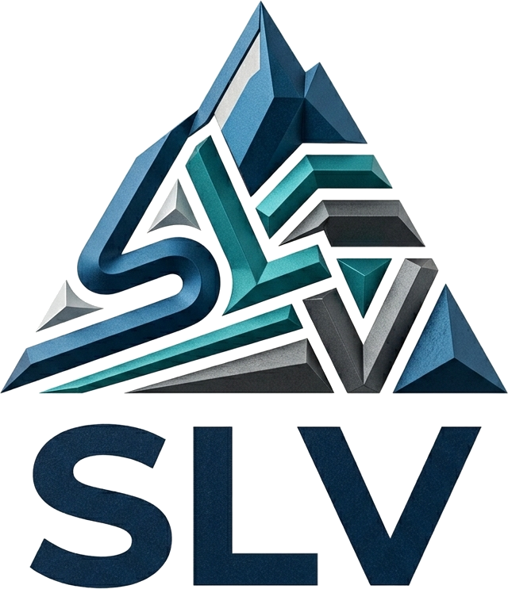

<p align="center">
  
</p>

# SLV — Análisis de Estabilidad de Taludes y Bancos

Aplicación de escritorio en Python para evaluar la estabilidad de bancos en minería. Calcula el factor de seguridad (FS) para los cuatro mecanismos de falla más comunes en taludes rocosos y genera un gráfico de la geometría analizada.

## Funcionalidades

| Mecanismo | Qué calcula |
|---|---|
| **Falla plana** | FS por equilibrio límite y verificación cinemática del plano de falla |
| **Falla en cuña** | Línea de intersección entre dos planos (dip / dip direction), su inclinación y el FS de la cuña |
| **Falla por volcamiento** | Condición cinemática de volcamiento según manteo del talud, buzamiento de discontinuidades y fricción |
| **Falla circular** | FS por método de dovelas (momentos resistentes / actuantes) |

Cada análisis valida los datos de entrada, entrega el resultado con su veredicto (estable / inestable) y muestra la figura dentro de la interfaz.

## Tecnologías

- **Python 3**
- **tkinter**: interfaz gráfica
- **NumPy**: cálculo numérico
- **Matplotlib**: visualización de la geometría del talud
- **Pillow** (opcional): mejor renderizado del logo

## Estructura

```
SLV/
├── slv.py                 # Interfaz principal (entrada, validación, resultados)
├── falla_plana.py         # Motor de cálculo: falla plana
├── falla_cuna2.py         # Motor de cálculo: falla en cuña
├── falla_volcamiento.py   # Motor de cálculo: volcamiento
├── falla_circular3.py     # Motor de cálculo: falla circular
├── slv_logo.png
└── slv_emblema.png
```

La interfaz no contiene fórmulas: solo pide datos, los valida y llama al módulo de cálculo correspondiente. Así cada mecanismo puede probarse y mantenerse por separado.

## Instalación y uso

```bash
git clone https://github.com/TU_USUARIO/SLV.git
cd SLV
pip install -r requirements.txt
python slv.py
```

> En Linux puede ser necesario instalar tkinter: `sudo apt install python3-tk`

## Autores

Proyecto desarrollado en el curso **Python Aplicado a la Minería (551603)**, Universidad de Concepción, 2026.

- **Luciano Soto**
- Sebastián Venegas
- Vicente Muñoz
